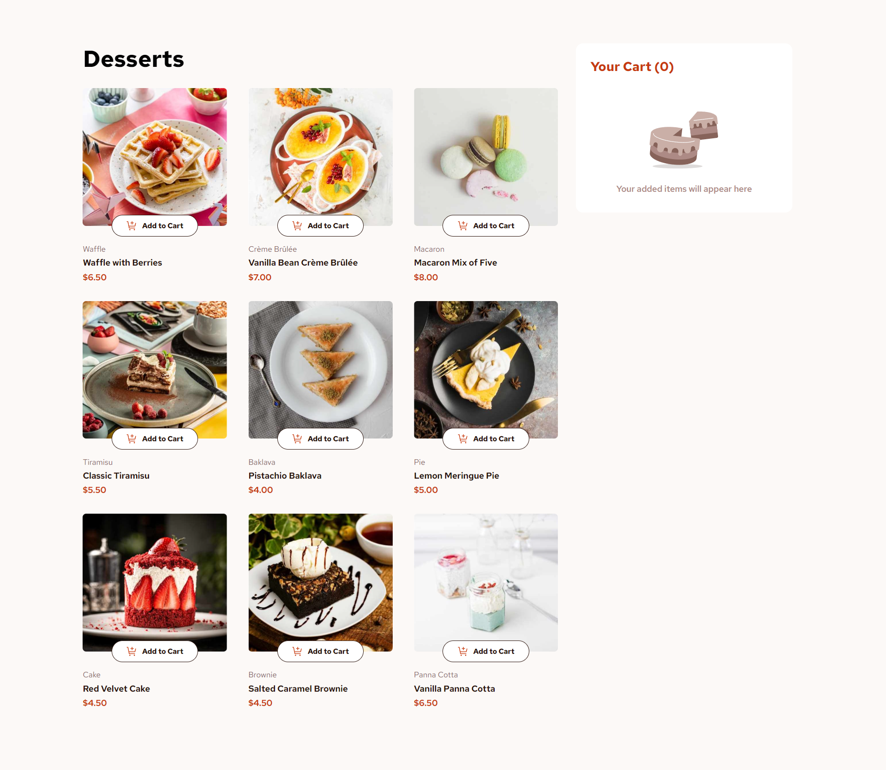
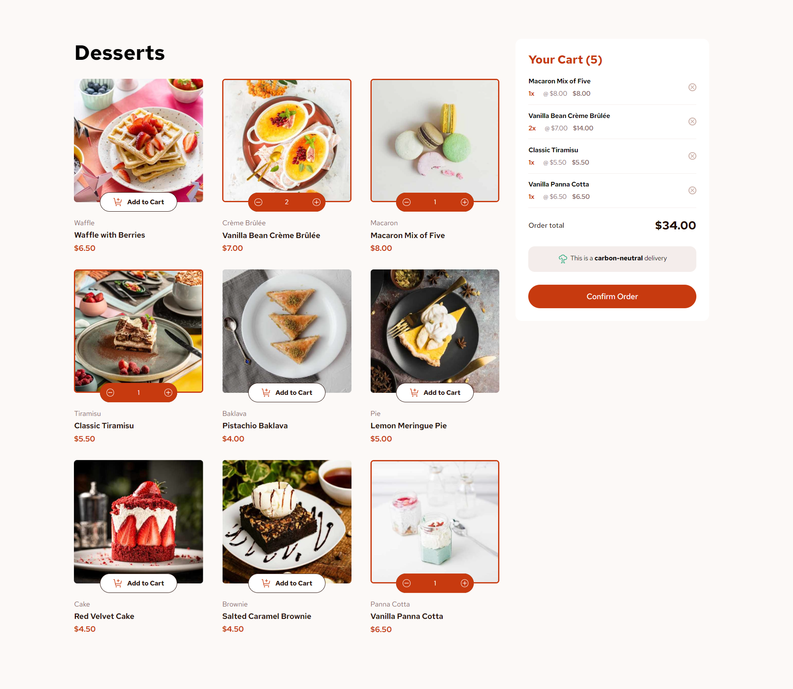
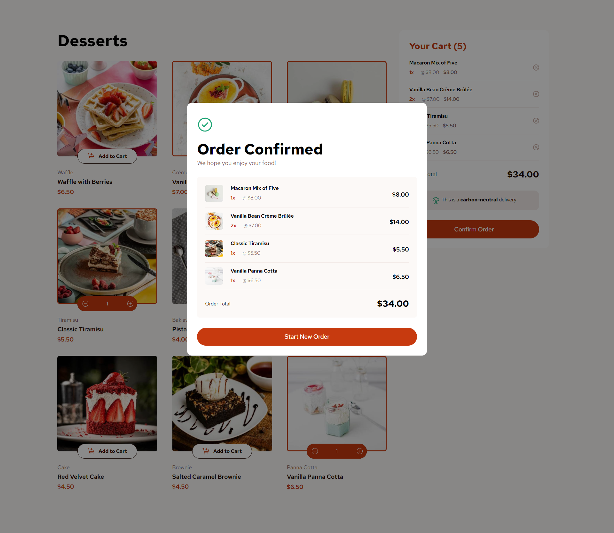

# Frontend Mentor - Product list with cart solution

This is a solution to the [Product list with cart challenge on Frontend Mentor](https://www.frontendmentor.io/challenges/product-list-with-cart-5MmqLVAp_d). Frontend Mentor challenges help you improve your coding skills by building realistic projects. 

## Table of contents

- [Overview](#overview)
  - [The challenge](#the-challenge)
  - [Screenshot](#screenshot)
  - [Links](#links)
- [My process](#my-process)
  - [Built with](#built-with)
  - [What I learned](#what-i-learned)
  - [Continued development](#continued-development)
- [Author](#author)

## Overview

### The challenge

Users should be able to:

- Add items to the cart and remove them
- Increase/decrease the number of items in the cart
- See an order confirmation modal when they click "Confirm Order"
- Reset their selections when they click "Start New Order"
- View the optimal layout for the interface depending on their device's screen size
- See hover and focus states for all interactive elements on the page

### Screenshot

### Links

- Solution URL: [Link](https://github.com/codebyveronica/poduct-list-with-card)
- Live Site URL: [Link](https://codebyveronica.github.io/poduct-list-with-card/)

## My process

### Built with

- Semantic HTML5 markup
- CSS custom properties
- Flexbox
- CSS Grid
- Mobile-first workflow
- JavaScript

### What I learned

I learned a lot from this project. I learned how to populate the DOM dynamically with JSON file. I learned how to use and create a JSON file. And how to use your data after populating the DOM. I also learned many other interactions with JavaScript on this project. The increment and decrement functionality was one of these, but I believe the most impactful is the cart functionality. I believe it is very important to know how to create one and know how to deal with quantities. This project served to create a foundation for this for me.

### Continued development

I plan to continue learning about JSON files, populating the DOM dynamically, and about Add to Cart and the Store Cart. Although this project was great to start learning and create a foundation on this, I only managed to do it by researching a lot. I want to keep learning and practicing until I can do it on my own and learn even more complex things to increase these features.

## Author

- Frontend Mentor - [@codebyveronica](https://www.frontendmentor.io/profile/codebyveronica)
